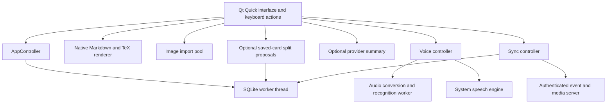

# Native application architecture

## Ownership and responsiveness

The interface, Qt networking objects, speech synthesis, and native text painting
belong to the application thread. A dedicated worker owns its SQLite connection
and all database transactions. Queued signals publish completed snapshots and
review queues; the interface advances a graded item only after its durable
transaction commits. Audio capture, sample conversion, voice activity detection,
and optional local recognition have a separate worker thread. Image validation
and content-addressed import run in the Qt thread pool.

Network operations are asynchronous and have timeouts and response limits.
Provider changes, cancellation, and card changes invalidate recognition epochs.
Markdown rebuilds are coalesced; rendered math and decoded images are cached.
Formula painting remains on the graphics thread. The prototype uses snapshot
lists rather than a paged database model, so very large collections still need
profiling and a paged model before making performance claims.

No browser engine, Electron runtime, local machine learning model, or Python
runtime is required by the desktop application. The independent sync server uses
Python's standard library.

## Collection and credentials

Source notes, independent review variants, immutable review history, deletion
tombstones, device metadata, and the outgoing event log live in local SQLite.
Each user mutation and its event are one transaction. Review queues are temporary
session state. Attached images live beside the database in `media/`, with
SHA-256 filenames. Collection backups include those image bytes and validate
their names, hashes, formats, dimensions, and decoding before importing records.

Provider keys and server tokens are held by native credential objects, separately
from collection data. Desktop persistence uses Secret Service through bounded,
serialized `secret-tool` processes. An unavailable keyring means session-only
storage. Keys are never exposed as readable QML properties. Android persistence
remains session-only until Keystore integration is implemented.

## Interface and platform boundaries

QML supplies one shared interface with fixed top bars, bounded content areas,
modal editors, and a collapsible left navigation pane with a persistent icon
rail. IBM Plex Mono is embedded for the interface and Markdown text. A narrow window opens card
details in a modal instead of shrinking the card list. Preferences persist
themes, keyboard bindings, page selection, and detail-pane sizing.
Review's idle view contains a bounded horizontal deck browser, an optional deck
tree, actual queue counts, and a large start action in the lower portion of the
page. Deck parents are stored and synchronized independently of their names.
Active review cards open in a rounded native modal, with a pinned header and
grading controls around a bounded Markdown view. Pause sits directly beside the
bounded deck title. The queue opens as a centered, horizontally scrollable
timeline with fading edges, without a rail or current label; the current
variant can scroll out of view in long queues. Viewport position controls
upcoming card disclosure and haze while card widths and gaps stay fixed.
The timeline retains the entire pending queue and completed session history,
instantiating only the cards near the viewport. Bounds keep the first card from moving past
the center and stop when the final card reaches the center. Selecting a pending
variant moves the review cursor and highlight without scrolling or reordering cards;
completed variants open for inspection without scheduling mutations. A reserved
control row shows Return to active card only when its body is outside the viewport.
A persistent horizontal scrollbar below the timeline maps its legal scroll bounds
and supports dragging and keyboard navigation.
A timer sits above the controls, and a large
rounded Reveal answer cover sits below the prompt. Dismissing the modal pauses
the response timer and retains the queue;
resuming reopens the same session.

The Android draft uses the same native modules. Its build preflight checks the
matching Qt kit, host tools, full JDK, SDK, NDK, and OpenSSL libraries. Voice is
disabled when Android leaves the foreground. A foreground audio service,
Bluetooth routing, background controls, and device lifecycle verification remain
required for the eventual hands-free phone experience.
