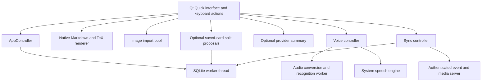

# Native application architecture

## Ownership and responsiveness

The interface, Qt networking objects, speech synthesis, and native text painting
belong to the application thread. A dedicated worker owns its SQLite connection
and all database transactions. Queued signals publish completed snapshots and
review sessions; the interface displays a selected grade after its durable
transaction commits. Navigation is an explicit user action. Audio capture, sample conversion, voice activity detection,
and optional local recognition have a separate worker thread. Image validation
and content-addressed import run in the Qt thread pool.

Network operations are asynchronous and have timeouts and response limits.
Provider changes, cancellation, and card changes invalidate recognition epochs.
Markdown rebuilds are coalesced; rendered math and decoded images are cached.
Formula painting remains on the graphics thread. The prototype uses snapshot
lists rather than a paged database model, so very large collections still need
profiling and a paged model before making performance claims.

No browser engine, Electron runtime, local machine learning model, or Python
runtime is required by the desktop application. The independent sync server uses
Python's standard library.

## Collection and credentials

Source notes, independent review variants, review history, deletion
tombstones, device metadata, and the outgoing event log live in local SQLite.
Each user mutation and its event are one transaction. Review queues are temporary
session state. Attached images live beside the database in `media/`, with
SHA-256 filenames. Collection backups include those image bytes and validate
their names, hashes, formats, dimensions, and decoding before importing records.

Provider keys and server tokens are held by native credential objects, separately
from collection data. Desktop persistence uses Secret Service through bounded,
serialized `secret-tool` processes. An unavailable keyring means session-only
storage. Keys are never exposed as readable QML properties. Android persistence
remains session-only until Keystore integration is implemented.

## Interface and platform boundaries

QML supplies one shared interface with fixed top bars, bounded content areas,
modal editors, and a collapsible left navigation pane with a persistent icon
rail. IBM Plex Mono is embedded for the interface and Markdown text. A narrow window opens card
details in a modal instead of shrinking the card list. Preferences persist
themes, keyboard bindings, page selection, and detail-pane sizing.
Review's idle view contains a bounded horizontal deck browser, an optional deck
tree, actual queue counts, and a large start action in the lower portion of the
page. Deck parents are stored and synchronized independently of their names.
Active review cards occupy a rounded container in the Review page, with a pinned
header and grading controls around a bounded Markdown view. Pause sits beside
the deck title. The collapsible ledger queue retains every card in session order,
instantiating only cards near the viewport. Viewport position controls upcoming
card disclosure and haze while card widths and gaps stay fixed. Bounds keep the
first and final cards from moving past the center. Selection changes the active
card without recentering the timeline. A Return to active card control appears
when the card is outside the viewport; a persistent scrollbar maps the extent.

A previous/next arrow bar spans each side of the main card. One tag capsule
appears in each preview and all tags appear above the prompt. The queue can be
collapsed without hiding progress or navigation. A segmented progress strip uses
the same outcome colors as the queue and grades. Leaving Review pauses the timer
and retains the queue. A timer sits above the controls, and a rounded Reveal
answer cover sits below the prompt.

The worker owns the ordered session list, including graded items. A grade leaves
the current item selected. Corrections reuse the original review identifier,
timestamp, response duration, and pre-review scheduling baseline. They do not
increment the review count again. A correction after leaving the card requires
confirmation. Each correction and its outgoing event commit together. The list
of pending cards exposed to summaries contains only ungraded items.

The Android draft uses the same native modules. Its build preflight checks the
matching Qt kit, host tools, full JDK, SDK, NDK, and OpenSSL libraries. Voice is
disabled when Android leaves the foreground. A foreground audio service,
Bluetooth routing, background controls, and device lifecycle verification remain
required for the eventual hands-free phone experience.
