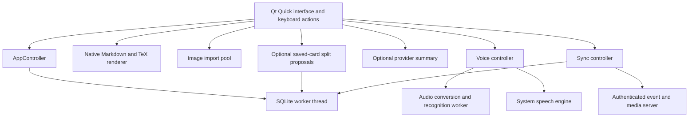

# Native application architecture

## Ownership and responsiveness

The interface, Qt networking objects, speech synthesis, and native text painting
belong to the application thread. A dedicated worker owns its SQLite connection
and all database transactions. Queued signals publish completed snapshots and
review queues; the interface advances a graded item only after its durable
transaction commits. Audio capture, sample conversion, voice activity detection,
and optional local recognition have a separate worker thread. Image validation
and content-addressed import run in the Qt thread pool.

Network operations are asynchronous and have timeouts and response limits.
Provider changes, cancellation, and card changes invalidate recognition epochs.
Markdown rebuilds are coalesced; rendered math and decoded images are cached.
Formula painting remains on the graphics thread. The prototype uses snapshot
lists rather than a paged database model, so very large collections still need
profiling and a paged model before making performance claims.

No browser engine, Electron runtime, local machine learning model, or Python
runtime is required by the desktop application. The independent sync server uses
Python's standard library.

## Collection and credentials

Source notes, independent review variants, immutable review history, deletion
tombstones, device metadata, and the outgoing event log live in local SQLite.
Each user mutation and its event are one transaction. Review queues are temporary
session state. Attached images live beside the database in `media/`, with
SHA-256 filenames. Collection backups include those image bytes and validate
their names, hashes, formats, dimensions, and decoding before importing records.

Provider keys and server tokens are held by native credential objects, separately
from collection data. Desktop persistence uses Secret Service through bounded,
serialized `secret-tool` processes. An unavailable keyring means session-only
storage. Keys are never exposed as readable QML properties. Android persistence
remains session-only until Keystore integration is implemented.

## Interface and platform boundaries

QML supplies one shared interface with fixed top bars, bounded content areas,
modal editors, and collapsible bottom navigation. A narrow window opens card
details in a modal instead of shrinking the card list. Preferences persist
themes, keyboard bindings, page selection, and detail-pane sizing.

The Android draft uses the same native modules. Its build preflight checks the
matching Qt kit, host tools, full JDK, SDK, NDK, and OpenSSL libraries. Voice is
disabled when Android leaves the foreground. A foreground audio service,
Bluetooth routing, background controls, and device lifecycle verification remain
required for the eventual hands-free phone experience.
